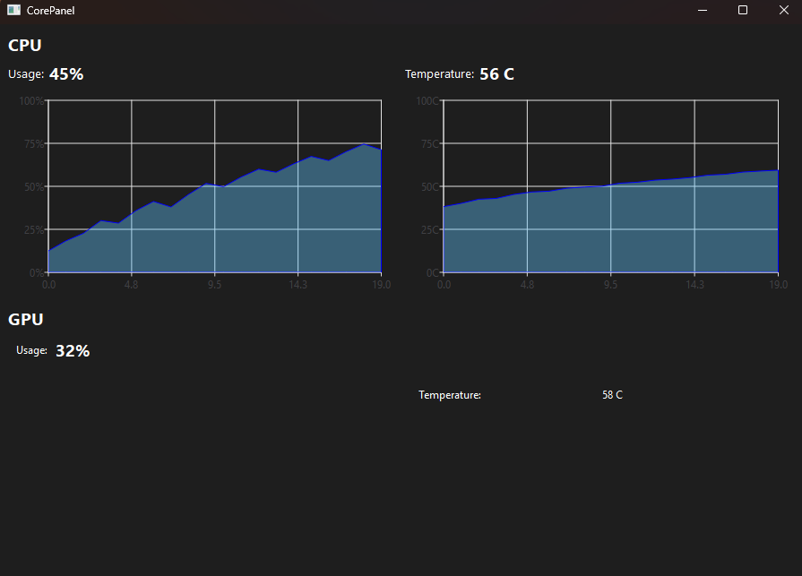

# CorePanel
Hello! My name is Pearce, and CorePanel is a project I've been working on to accurately display usage and temperatures of various hardware components in your computer! More will be coming soon, here's a list of updates and the development process.

**Tech Stack:**
- C++
- Qt (C++ based for UI)
- .NET Libraries

**Update History:**
- 7/22/2025 - HardwareReader.exe CAN read CPU temp! Needed admin permission to launch app :)
- 7/21/2025 - HardwareReader.exe CANNOT read CPU temp, going to have to move to HWiNFO :(. Did have usages working though!
- 7/15/2025 - Creating HardwareReader.exe using .NET libraries, attempting to read data to Qt project
- 7/13/2025 - Added README for update tracking and landing page, also progress screenshot
- 7/12/2025 - GPU panel started in Qt, styling changes
- 7/11/2025 - Qt styling, created CPU section
- 7/10/2025 - Qt learning, widget vs layout issues, so frustrating lol
- 7/1/2025 - Qt layout design, planning directory in project/repo
- 6/30/2025 - Init repo with Qt, Qt testing with various buttons + fun stuff!

**Screenshots**
- Screenshot from 7/13/2025 - CPU graphs created, placeholders

