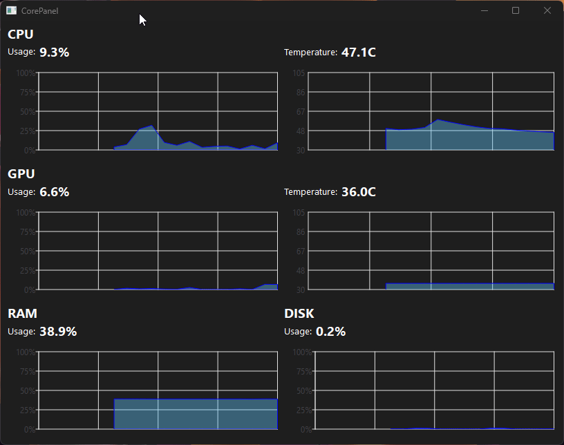

# CorePanel
Hello! I'm Pearce, and CorePanel is a C++/Qt desktop app that displays real-time usage and temperatures for your CPU, GPU, RAM, and storage device!

This project is a combination of a Qt based UI with a C# backend to read data.

## Tech Stack:
- **C++** - Real time graphing and data display, all logic
- **Qt** - UI application (Q Packages like QMainWindow, QChart, layouts, widgets, etc.)
- **C#** - HardwareReader backend utilizing LibreHardwareMonitor (.NET 9.0)
- **LibreHardwareMonitor** - Access to sensors, temps, and usage

## Features:
- Real-time charts for:
    - CPU usage and temperature
    - GPU usage and temperature
    - RAM usage
    - Disk usage
- Clean, minimal UI, small window
- Portable folder for easy deployment

## Demos and Screenshots:
- Demo Gif from 7/24/2025 - All core features created

- Screenshot from 7/13/2025 - CPU graphs created, placeholders

## Notes:
- Requires Windows and will prompt for admin access (needed for temperature readings)
- Built on Windows 11 with AMD CPU and AMD graphics card
- CorePanel relies on LibreHardwareMonitor to retrieve system metrics. This is an excellent open source library, but sensor data could vary and may not match exactly to the actual values observed

**Update History:**
- 7/24/2025 - FIRST RELEASE! Working in standalone folder! All charts added! :)
- 7/23/2025 - Pulling in data in graphs now, CPU and GPU!!!! Super stoked, made graph class as well
- 7/22/2025 - HardwareReader.exe CAN read CPU temp! Needed admin permission to launch app :)
- 7/21/2025 - HardwareReader.exe CANNOT read CPU temp, going to have to move to HWiNFO :(. Did have usages working though!
- 7/15/2025 - Creating HardwareReader.exe using .NET libraries, attempting to read data to Qt project
- 7/13/2025 - Added README for update tracking and landing page, also progress screenshot
- 7/12/2025 - GPU panel started in Qt, styling changes
- 7/11/2025 - Qt styling, created CPU section
- 7/10/2025 - Qt learning, widget vs layout issues, so frustrating lol
- 7/1/2025 - Qt layout design, planning directory in project/repo
- 6/30/2025 - Init repo with Qt, Qt testing with various buttons + fun stuff!

## Contact

  If you like this project and want to chat with me, here's some of my links! :)  
  <a href="https://pearcepackman.com/" target="_blank">🌐 Portfolio Website</a> |
  <a href="https://www.linkedin.com/in/pearce-packman/" target="_blank">🔗 LinkedIn</a> |
  <a href="mailto:pearcepackman@gmail.com">📧 Email</a>

